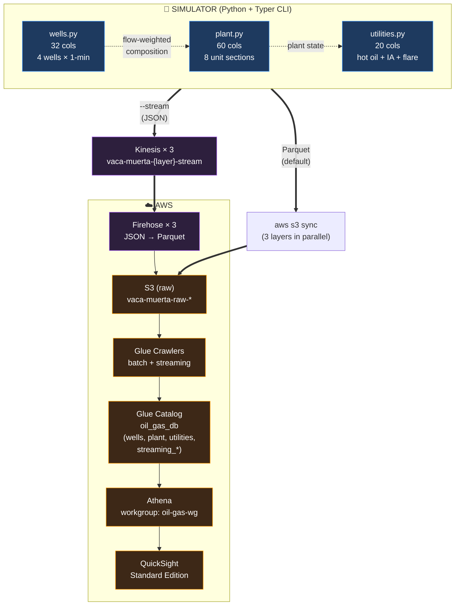

# Vaca Muerta SCADA Simulator → AWS Analytics Pipeline

[](https://c4chiv4che.github.io/oil-gas-quicksight/)
[](https://github.com/c4chiv4che/oil-gas-quicksight/actions/workflows/python-tests.yml)
[](https://github.com/c4chiv4che/oil-gas-quicksight/actions/workflows/terraform.yml)
[](https://github.com/c4chiv4che/oil-gas-quicksight/actions/workflows/deploy.yml)


End-to-end data engineering project that simulates a realistic Vaca Muerta shale operation (wellpad + gas processing plant + utilities) and lands the data in AWS for analysis with Athena and QuickSight.

A static **HMI frontend** (React + Vite, PI-Vision-style) replays the dataset as a live demo — see [Live HMI](#-live-hmi--c4chiv4chegithubiooil-gas-quicksight) below.

Built as a learning project to combine 4 years of OT/industrial automation experience with modern cloud data tooling, calibrated against training material authored by senior Argentinian O&G professionals.

---

## 🖥️ Live HMI — [c4chiv4che.github.io/oil-gas-quicksight](https://c4chiv4che.github.io/oil-gas-quicksight/)

A browser-based **SCADA-style HMI** that replays the recorded dataset as a simulated real-time feed — no servers, no streaming infrastructure, just a static site reading versioned JSON. It mirrors the look and interaction model of **AVEVA PI Vision**, the historian/visualization tool used in the ITP Neuquén control-room operator course this project is calibrated against.

What you can do in the live demo:

- **Well Overview** — all four wells at a glance, each color-coded by health (multi-state). Click a well to drill into its detail.
- **Oil Well Detail** — per-well value boxes, radial gauges, a live production trend, and an ESD event log, all driven by a shared simulated clock.
- **Time transport** — play / pause / 1×–60× speed / scrub through the full day. Scrub to **2026-03-15 14:00** to watch the plant ESD cascade across every symbol in real time.

The HMI follows **ISA-101** human-machine-interface conventions: a quiet, low-color baseline during normal operation, with color reserved for genuine alarm states (and a switchable high-contrast theme).

<!-- TODO: add screenshots, e.g.:


-->

> **New to oil & gas?** Read the plain-language overview: [English](docs/OVERVIEW.md) · [Español](docs/OVERVIEW.es.md)

---

## What this does

A multi-layer SCADA-style simulator generates ~1.5M signal records over 180 days for:

- **4 horizontal shale wells** with ESP lift, multi-stage frac, Arps decline curves, and lifecycle phases (IDLE → FLOWBACK → PRODUCING → DECLINE)
- **A full gas processing plant**: slug catcher → 3-phase separator → TEG dehydration → LTS/propane refrigeration → condensate stabilizer → centrifugal compression → fiscal metering
- **Utilities**: hot oil heater, instrument air, flare system with HP/LP/wet sections

Signals follow **ISA 5.1 tag naming** (PT, TT, FT, LT, VT, AI, etc.) and the gas quality output is benchmarked against **ENARGAS NAG-602** — the Argentinian norm for natural gas pipeline transport (PCS, Wobbe Index, H2S, water content, hydrocarbon dew point).

A full **ESD (Emergency Shutdown) state machine** simulates 8-step plant trip sequences with realistic timing: depressurization to flare → compressor trip → utilities down → hold → recovery.

Data lands in S3 (Parquet, date-partitioned), gets crawled into Glue, and is queryable via Athena. QuickSight datasets are wired but the v2 multi-layer dashboard is pending.

A parallel **streaming pipeline** (Kinesis → Firehose JSON→Parquet → `streaming_*` Glue tables) lets the same simulator feed Athena as a live data stream rather than a finished file. Streaming infrastructure is operated **on-demand** (applied for a demo, then destroyed) — see [Streaming runbook](docs/ARCHITECTURE.md#streaming-runbook-on-demand).

---

## Architecture



See [docs/ARCHITECTURE.md](docs/ARCHITECTURE.md) for full details.

### Frontend HMI (live demo path)

Separately from the AWS analytics path, the simulator's recorded output is committed to the repo as static JSON and served by a React/Vite single-page app on GitHub Pages. This gives a permanently-live "real-time" demo without keeping streaming infrastructure running. The HMI reads the same physical signals (per-well pressures, temperatures, production rates) and the ESD event timeline, and renders them through PI-Vision-style symbols (value boxes, radial gauges, trends, an events table) on a shared simulated clock.

Design decisions worth noting:

- **Fixed Y-axis scales** on trends and gauges (gauges run exactly `0..hihi`; trends bottom at `0` and extend ~10% past `hihi`) — operators rely on stable scales for at-a-glance reading; auto-scaling axes that move under an alarm are an ISA-101 anti-pattern.
- **Multi-state from real percentile limits** — per-well alarm thresholds (lo/lolo/hi/hihi) tuned from the dataset's own p5–p95 of PRODUCING samples, so color reflects each well's normal operating envelope.
- **SHUTDOWN is "stale", not "alarm"** — a deliberate operational stop is greyed out, not red; red is reserved for a genuine failure. The Overview cards combine this with production state (oil/gas below lolo) so a tripped plant still reads as alarm — honestly derived, not hard-coded.
- **The ESD is plant-wide** — the event log and banner are the same regardless of which well you view, because the 2026-03-15 trip is a plant trip that takes all wells down at once.

---

## Quickstart

### Prerequisites

- WSL2 / Linux / macOS
- Python 3.12+ with [`uv`](https://docs.astral.sh/uv/)
- Docker (for LocalStack development)
- AWS CLI v2 + Terraform 1.5+
- An AWS account (sandbox/learning OK — total cost runs <$1/month with QuickSight Standard already active)

### Clone and inspect

```bash
git clone https://github.com/c4chiv4che/oil-gas-quicksight.git
cd oil-gas-quicksight
make help
```

### Run the simulator locally (no AWS)

```bash
# Quick 30-day smoke test (~5 seconds)
make sim-smoke

# Full 180-day run with injected ESD event and gas-lock (~60 seconds)
make sim-full
```

Outputs land in `simulator/data/raw/{wells,plant,utilities}/` as Parquet files partitioned by date.

### Run the HMI frontend locally

```bash
cd frontend
npm install
npm run dev        # serves at http://localhost:5173/ (base '/')
```

The frontend reads the recorded JSON from `data/demo/` (committed to the repo via a symlink in `frontend/public/`), so it runs with no AWS and no backend.

### Deploy to AWS (full pipeline)

```bash
# 1. Configure AWS profile
aws configure --profile oil-gas-dev

# 2. Deploy infrastructure (one-time)
cd infra/aws
terraform init
terraform apply

# 3. Generate, upload, crawl, query — end-to-end
cd ../..
make all
```

`make all` executes: clean local → generate 180d → upload to S3 → trigger Glue Crawler → run 5 validation queries.

---

## Make targets

| Target            | Description                                                       |
|-------------------|-------------------------------------------------------------------|
| `make help`       | Show all targets (default)                                        |
| `make sim-smoke`  | 30-day / 5-min simulation (smoke test, ~5s)                       |
| `make sim-full`   | 180-day / 1-min simulation with injected ESD + gas-lock (~60s)    |
| `make sim-upload` | Sync all 3 layers to S3 in parallel                               |
| `make crawl`      | Trigger Glue Crawler, wait until ready, list tables               |
| `make athena-test`| Run all 5 validation queries against Athena                       |
| `make tf-plan`    | Terraform plan on AWS infra                                       |
| `make tf-apply`   | Terraform apply with `-refresh=false` (see Known Issues)          |
| `make all`        | Full pipeline: clean → simulate → upload → crawl → query          |
| `make sim-clean-local` | Remove local Parquet output                                  |
| `make sim-clean-s3`    | Delete S3 data (prompts for confirmation)                    |

---

## Project structure

```text
.
├── simulator/                      # The simulator itself (uv-managed)
│   ├── pyproject.toml
│   └── src/
│       ├── config.py               # Pad/well/signal constants, S3 buckets
│       ├── physics.py              # Arps decline, GOR creep, hydrate curves, anti-surge
│       ├── quality.py              # GasComposition, PCS/Wobbe/density, TEG, LTS
│       ├── events.py               # WellEvent/PlantEvent/ESDReason enums, ESD state machine
│       ├── wells.py                # Layer 1: 4 wells with state machines
│       ├── plant.py                # Layer 2: 8 plant unit sections
│       ├── utilities.py            # Layer 3: hot oil + IA + flare
│       ├── output.py               # Parquet writes + S3 upload + Rich summary
│       ├── cli.py                  # Typer CLI
│       └── simulator.py            # Main entry point
├── frontend/                       # SCADA-style HMI (React + Vite + TS)
│   ├── package.json
│   ├── vite.config.ts              # conditional base for GitHub Pages subpath
│   ├── public/
│   │   └── data/demo -> ../../../data/demo   # symlink to recorded JSON
│   └── src/
│       ├── sim/                    # simulated clock (rAF, drift-free) + store
│       ├── data/                   # data loaders, useSeries, tag config, useActiveEsdPhase
│       ├── state/                  # Zustand stores (asset, display)
│       ├── symbols/                # ValueSymbol, GaugeSymbol, TrendSymbol, EventsTable
│       ├── displays/               # OilWellDetail, Overview, DisplayRouter, EsdBanner
│       ├── components/             # TimeTransport (global transport bar)
│       └── theme/                  # ISA-101 + high-contrast theming
├── infra/
│   ├── localstack/                 # Local AWS for dev/testing (S3 only)
│   └── aws/                        # Production AWS (S3, Glue, Athena, QuickSight, IAM)
├── analytics/
│   ├── queries/                    # 5 versioned Athena SQL queries
│   └── run_query.sh                # Athena runner with CSV output
├── docs/
│   ├── SIMULATOR_SPEC.md           # Full domain spec (IAPG/ITP Neuquén/NAG-602)
│   └── ARCHITECTURE.md             # Architecture details + known issues
├── .github/
│   ├── workflows/                  # CI: terraform fmt + validate on PRs
│   └── ISSUE_TEMPLATE/             # Bug report templates
└── Makefile
```

---

## Domain sources

This is not a toy simulator. The signal ranges, equipment behavior, and ESD sequence are calibrated against real Argentinian O&G operations material:

- **IAPG** (Instituto Argentino del Petróleo y del Gas) — industry reference for upstream operations
- **ITP Neuquén** — "Operador de Sala de Control de Procesos Hidrocarburíferos" 12-week course (real DCS screenshots, equipment specifications, ESD procedures)
- **ENARGAS NAG-602 (2019)** — Argentinian regulatory norm for natural gas quality in transport and distribution pipelines
- **API specs** for centrifugal compression (suction 60 kg/cm² / discharge 65 kg/cm² from real plant data)

The simulator's `quality.py` module computes PCS (Gross Heating Value) and Wobbe Index per ISO 6976 / IRAM-IAPG A 6854 standards, and the output is validated against NAG-602 Tabla 1 spec limits.

---

## Validation

Five Athena queries run as part of `make athena-test` and confirm the simulator output is physically correct:

| # | Query                       | Validates                                              |
|---|-----------------------------|--------------------------------------------------------|
| 1 | `01_overview.sql`           | Row counts and date ranges per layer                   |
| 2 | `02_esd_timeline.sql`    | 8-step ESD sequence: DEPRESSURE → COMPRESSOR_TRIP → UTILITIES_DOWN → HOLD → RECOVERY |
| 3 | `03_flare_during_esd.sql`| HP flare spike to ~140-176 Mm³/d during depressurization; hot oil drop from 260°C to 130°C |
| 4 | `04_nag602_compliance.sql`  | PCS within 8850-10200 kcal/m³ (✓); Wobbe Index above 12470 limit (intentional dashboard signal) |
| 5 | `05_well_lifecycle.sql`     | IDLE → FLOWBACK → PRODUCING transitions; injected GAS_LOCK appears on LLL-002 only |

Current dataset spans **2025-11-20 → 2026-05-19** (181 days, 1-minute frequency) with an injected ESD event at 2026-03-15 14:00 (reason: FIRE_GAS_HIGH) and a gas-lock event on LLL-002 at 2026-04-10 08:00.

---

## Status

### ✅ Working

- Simulator v2 — 3-layer modular architecture
- LocalStack-based dev environment (S3 only, community edition)
- Real AWS deployment via Terraform (S3, Glue, Athena, IAM)
- ESD state machine with realistic 8-step sequence
- Gas quality propagation with NAG-602 compliance checks
- Glue Crawler covering all 3 layers
- 5 validated Athena queries
- Automation layer (Makefile, run scripts, CI)
- QuickSight Author user + Athena data source + initial `wells` dataset
- **Kinesis streaming pipeline** — Kinesis Data Streams + Firehose JSON→Parquet + dedicated streaming crawlers for all 3 layers (operated on-demand)
- **Two-identity IAM model** — narrow `oil-gas-dev` runtime policy + documented `oil-gas-deploy-policy` for admin operations
- Comprehensive test suite — 190 automated tests, 93% coverage
- **Live HMI frontend** — PI-Vision-style SCADA HMI (React + Vite + TypeScript) deployed to GitHub Pages; recorded dataset replayed as a simulated real-time feed. Well Overview + per-well detail, multi-state alarms, live trends, ESD event timeline, ISA-101 theming, asset switching, and display navigation.
- **Automated Pages deploy** — GitHub Actions builds the frontend and publishes to GitHub Pages on every push to `main` (official Pages actions, OIDC, no `gh-pages` branch).

### 🚧 Pending

- **QuickSight v2 dashboards** — multi-layer ESD timeline, flare analytics, fiscal gas quality vs NAG-602
- **Amazon Timestream** integration — AWS Support ticket open to enable LiveAnalytics on the account

### 🐛 Known issues

- The Terraform AWS provider's `aws_quicksight_data_set` resource reads `DescribeDataSetRefreshProperties` during plan/refresh, but that action is not honored by `quicksight:*` wildcard policies — even when listed explicitly. Workaround: `terraform apply -refresh=false` (already wired into `make tf-apply`). See [docs/ARCHITECTURE.md](docs/ARCHITECTURE.md#known-issues) for details.

---

## Tech stack

**Simulation**: Python 3.12, [uv](https://docs.astral.sh/uv/), [Typer](https://typer.tiangolo.com/), [Rich](https://rich.readthedocs.io/), Pandas, PyArrow

**Frontend HMI**: React 19, [Vite](https://vite.dev/) 8, TypeScript, [Zustand](https://github.com/pmndrs/zustand) (state), [µPlot](https://github.com/leeoniya/uPlot) (trends), pure SVG symbols, deployed on GitHub Pages

**Infrastructure**: Terraform 1.5+, AWS (S3, Glue, Athena, QuickSight, IAM, CloudWatch), [LocalStack](https://localstack.cloud/) for dev

**Automation**: GNU Make, AWS CLI v2, GitHub Actions (terraform fmt + validate)

**Development**: WSL2 Ubuntu 24.04, [Claude Code](https://docs.claude.com/en/docs/claude-code) for AI-assisted development

---

## Cost

Steady-state monthly AWS cost: **~$9.30/month** (QuickSight Standard + everything else <$0.30 combined).

- S3: <$0.01/month (~130 MB total)
- Glue Crawler: ~$0.04 per crawl (run on-demand)
- Athena: ~$0.05 per 5 queries (~30 MB scanned each)
- QuickSight Standard: $9/month (1 author seat, already active)
- Kinesis streaming: **~$33/month if left on 24/7** (3 streams × $11/mo per shard) — operated **on-demand**, so steady-state contribution is ~$0

Total project marginal cost since starting: <$0.50.

A CloudWatch billing alarm at $10/month is configured (`oil-gas-billing-10usd`) — bringing streaming up will trip it within a day if you forget to tear it down.

See [docs/ARCHITECTURE.md → Cost](docs/ARCHITECTURE.md#cost) for the full table.

---

## License

MIT.

---

## Disclaimer

This is a **learning project**. The simulator generates synthetic data calibrated against public domain industry references; it does not represent any actual operating asset. The author has 4 years of OT experience in industrial automation and is using this project to learn modern cloud data engineering tooling. The domain knowledge (signal ranges, equipment behavior, NAG-602 compliance) is calibrated against training material authored by senior Argentinian O&G professionals (IAPG, ITP Neuquén).

If you work in the Argentinian O&G industry and spot something physically incorrect, [open an issue](https://github.com/c4chiv4che/oil-gas-quicksight/issues) — feedback welcome.


