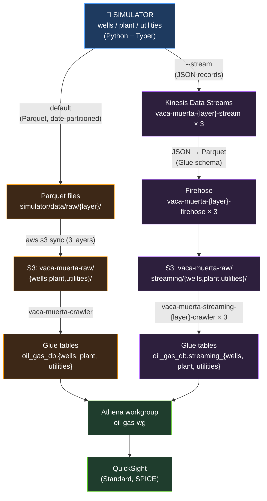

# Architecture

## Overview

The Vaca Muerta QuickSight lab is a self-contained data platform prototype
for unconventional shale operations. A Python simulator produces three
layers of synthetic SCADA data (wells, processing plant, utilities) and
exposes them to Athena and QuickSight via two parallel pipelines: a
**batch** path (Parquet → S3 → Glue crawler) and an **on-demand streaming**
path (Kinesis → Firehose JSON→Parquet → streaming Glue tables). Real Vaca
Muerta physics, ISA 5.1 tag naming, and ENARGAS NAG-602 fiscal gas specs
drive the data — see `docs/SIMULATOR_SPEC.md`.

## Data flow

Two pipelines, same simulator, both terminating at Athena and (eventually)
QuickSight. Batch is the steady-state path; streaming is brought up on
demand and torn down after a demo (see [Streaming runbook](#streaming-runbook-on-demand)).



Batch tables (`wells`/`plant`/`utilities`) and streaming tables
(`streaming_wells`/`streaming_plant`/`streaming_utilities`) coexist in the
same Glue database; partition layouts can diverge without colliding.

## AWS resources currently deployed

Managed by Terraform under `infra/aws/`. Streaming resources are present
in the module but are typically destroyed between demos — see the cost
section.

| Kind | Name | Purpose |
|---|---|---|
| S3 bucket | `vaca-muerta-raw-919064997947` | Raw Parquet from the simulator (versioned). Also hosts `streaming/*`. |
| S3 bucket | `vaca-muerta-curated-919064997947` | Reserved for downstream curated outputs. |
| S3 bucket | `vaca-muerta-athena-results-919064997947` | Athena query result location. |
| IAM role | `oil-gas-glue-role` | Glue crawler execution role (S3 read/write + AWSGlueServiceRole). |
| IAM role | `oil-gas-firehose-role` | Firehose execution: reads streams, writes `streaming/*`, reads Glue schema. |
| IAM policy | `oil-gas-dev-runtime` | Managed policy on the runtime user (consolidates the previous inline policies). |
| IAM policy | `oil-gas-deploy-policy` | Documentation-as-code; full deploy permissions, **not attached** by Terraform. |
| Glue DB | `oil_gas_db` | Catalog database for batch + streaming tables. |
| Glue crawler | `vaca-muerta-crawler` | Crawls `s3://…/wells/`, `…/plant/`, `…/utilities/` → batch tables. |
| Glue crawler | `vaca-muerta-streaming-{wells,plant,utilities}-crawler` (×3) | Crawls `s3://…/streaming/<layer>/` → `streaming_<layer>` tables. |
| Athena WG | `oil-gas-wg` | Enforced workgroup; results land in athena-results bucket. |
| Kinesis stream | `vaca-muerta-{wells,plant,utilities}-stream` (×3) | One stream per layer (1 shard, 24h retention). |
| Firehose | `vaca-muerta-{wells,plant,utilities}-firehose` (×3) | Buffers, converts JSON → Parquet via Glue schema, lands `streaming/<layer>/`. |
| CW Logs | `/aws/kinesisfirehose/vaca-muerta-{layer}-firehose` (×3) | Firehose delivery + error logs (7-day retention). |
| QuickSight user | `oil-gas-dev` (AUTHOR) | IAM-identity-type author in the `default` namespace. |
| QuickSight datasource | `athena-oil-gas` | ATHENA type, pointed at `oil-gas-wg`. |
| QuickSight dataset | `wells` (SPICE) | Subset of columns from `oil_gas_db.wells`, typed for QS. |

## Deployment & permissions model

This project uses a **two-identity model** to keep day-to-day producer
credentials minimally scoped while still letting infrastructure changes go
through Terraform.

### Deploy / admin identity — `default` profile

Runs `terraform apply`. Needs broad permissions: S3 bucket lifecycle,
Glue catalog + crawlers, Athena workgroups, Kinesis streams, Firehose
delivery streams, IAM role + inline-policy management for the
`oil-gas-*` roles, CloudWatch Logs, and QuickSight resource management.

The full required permission set is documented as code in
`infra/aws/iam-deploy.tf` as the managed policy `oil-gas-deploy-policy`.
That policy is **not attached to any user** by Terraform — it exists as
reference + ready-to-attach. In this setup the admin identity is the IAM
user behind the AWS CLI `default` profile; privileged operations are run
explicitly via:

```bash
TF_VAR_aws_profile=default terraform apply
```

> **Trade-off (documented honestly):** In this setup the admin identity
> is the `default` profile, which means a forgotten `--profile` flag
> would still run with admin creds. In a stricter environment you'd make
> the restricted user the default and require an explicit `--profile`
> for admin actions, so privileged commands can't run by accident. This
> is an intentional ergonomic choice for a single-operator lab account.

### Runtime identity — `oil-gas-dev`

The default value of `var.aws_profile` in `infra/aws/variables.tf` is
`oil-gas-dev`. This is the **runtime** user — the one the simulator
producer, the QuickSight author session, and ad-hoc Athena queries use.
It is service-scoped to S3 / Glue (read) / Athena / Kinesis (produce only)
and is the same IAM user registered as a QuickSight AUTHOR (see
`infra/aws/quicksight.tf`).

For the streaming producer the runtime policy already grants, on the
`vaca-muerta-{wells,plant,utilities}-stream` ARNs:

- `kinesis:PutRecord` / `kinesis:PutRecords`
- `kinesis:DescribeStream` / `kinesis:DescribeStreamSummary` / `kinesis:ListShards`

Granted by `aws_iam_policy.runtime` in `infra/aws/iam-runtime.tf`. The
deploy policy is intentionally **not** broadened to cover the runtime
surface, and vice versa — keep both narrow.

### Switching profiles

The default of `var.aws_profile` (`oil-gas-dev`) means `terraform plan` /
refresh-only operations Just Work for the read paths. For any apply that
touches IAM, Kinesis, Firehose, CloudWatch Logs, or the QuickSight
account subscription, override per-invocation:

```bash
TF_VAR_aws_profile=default terraform apply
```

This avoids permanently elevating `oil-gas-dev` and keeps the blast
radius of leaked runtime credentials small.

## Streaming runbook (on-demand)

Streaming is **not** left running 24/7. The model is: bring it up for a
demo, run the producer, verify, tear it down. Expected wall-clock to
bring up + verify + tear down is ~10 minutes.

### Pre-requisite

The batch tables `oil_gas_db.{wells, plant, utilities}` must exist —
Firehose reads their column schema for JSON→Parquet conversion. Run
`make crawl` once if they aren't there yet.

### 1. Bring up

```bash
cd infra/aws
TF_VAR_aws_profile=default terraform apply \
  -target='aws_kinesis_stream.layer' \
  -target='aws_iam_role.firehose' \
  -target='aws_iam_role_policy.firehose' \
  -target='aws_cloudwatch_log_group.firehose_layer' \
  -target='aws_cloudwatch_log_stream.firehose_layer_s3' \
  -target='aws_kinesis_firehose_delivery_stream.layer' \
  -target='aws_glue_crawler.streaming_layer'
```

### 2. Run the producer

```bash
uv run python -m src.simulator \
  --days 1 --freq 30 --stream \
  --profile oil-gas-dev
```

`--layers` defaults to `wells,plant,utilities` — all three streams get
records. At 30-second frequency a 1-day run is the standard smoke test.

### 3. Verify

S3 — Firehose buffer flushes every 60s, so wait ~1–2 minutes:

```bash
aws s3 ls s3://vaca-muerta-raw-919064997947/streaming/wells/ \
  --recursive --profile oil-gas-dev
```

Catalog — kick the streaming crawler(s):

```bash
aws glue start-crawler --name vaca-muerta-streaming-wells-crawler \
  --profile default
```

Query — once the crawler finishes:

```sql
SELECT count(*) FROM oil_gas_db.streaming_wells;
```

If records land in `streaming/<layer>_errors/` instead, see the Firehose
timestamp issue under Known issues.

### 4. Tear down

```bash
cd infra/aws
TF_VAR_aws_profile=default terraform destroy \
  -target='aws_kinesis_firehose_delivery_stream.layer' \
  -target='aws_kinesis_stream.layer' \
  -target='aws_glue_crawler.streaming_layer' \
  -target='aws_cloudwatch_log_stream.firehose_layer_s3' \
  -target='aws_cloudwatch_log_group.firehose_layer' \
  -target='aws_iam_role_policy.firehose' \
  -target='aws_iam_role.firehose'
```

S3 objects under `streaming/<layer>/` are kept (they're cheap and let
Athena queries replay history). Delete them manually if you want a clean
slate.

## Cost

Approximate, honest, single-operator lab account. All figures USD/month.

| Component | Cost | Notes |
|---|---|---|
| S3 (raw + curated + athena-results) | <$0.01 | ~130 MB total |
| Glue crawlers (batch + streaming) | <$0.10 | On-demand runs only |
| Athena | <$0.10 | ~30 MB scanned per validation query |
| QuickSight Standard | $9.00 | 1 author seat, already active on the account |
| Kinesis Data Streams (3 × 1 shard) | **~$33** if 24/7 | ~$11/mo per shard. **On-demand keeps this ~$0** (see runbook). |
| Firehose ingestion + CW Logs | <$0.10 | Negligible at lab volume |
| **Steady state (batch + QS, streaming torn down)** | **~$9.30** | What this project actually costs day-to-day |
| If streaming left running 24/7 | ~$42 | Not the operating model |

A CloudWatch billing alarm at $10/month (`oil-gas-billing-10usd`) catches
any drift before it gets expensive.

## Decision log

Short rationale for the architectural choices that aren't self-evident
from the code.

### (a) One Kinesis stream per layer, not one multiplexed stream

**Decision:** Three separate `vaca-muerta-<layer>-stream` streams, each
with its own Firehose. **Rationale:** Each layer has a distinct Parquet
schema in Glue; Firehose's JSON→Parquet conversion binds one Firehose
to one Glue table, so multiplexing would require either a Lambda
transform step or a single ultra-wide table. **Trade-off:** 3× the
shard cost ($33 vs $11 if running 24/7), accepted because streaming
runs on-demand.

### (b) On-demand streaming, not 24/7

**Decision:** Streaming resources are applied for demos and destroyed
after. **Rationale:** A persistent 1-shard Kinesis stream costs ~$11/mo
regardless of throughput; three layers running 24/7 ($33/mo) would
quadruple the project's steady-state spend with no demo benefit.
**Trade-off:** Adds a ~5-minute apply step before each demo, and the
streaming crawler must re-discover partitions on each cycle.

### (c) Two-identity IAM model (runtime vs deploy)

**Decision:** `oil-gas-dev` runs the producer and queries; `default`
(admin) runs `terraform apply`. Each has its own managed policy
(`oil-gas-dev-runtime`, `oil-gas-deploy-policy`). **Rationale:** If
producer credentials leak, the attacker gets PutRecord + Athena query
scope — not IAM/Kinesis/Firehose create/destroy. **Trade-off:** Two
profiles to keep in sync and a `TF_VAR_aws_profile=default` prefix on
every apply that touches IAM/Kinesis/Firehose. The "admin is default"
ergonomic choice is called out in the Deploy section above.

### (d) Batch + streaming as parallel paths, not streaming replacing batch

**Decision:** Batch (Parquet → S3 → crawler) stays the primary path;
streaming lands in separate `streaming_*` tables. **Rationale:** Batch
is reproducible (`make sim-full && make sim-upload && make crawl`),
queries scan ~30 MB cheaply, and the 6-month dataset is the foundation
for QuickSight dashboards. Streaming exists to *demonstrate* live data
capability, not to replace the historical store. **Trade-off:** Two
tables per layer for callers to know about; analysts have to choose
`wells` vs `streaming_wells`. Acceptable because the use cases differ
(dashboards vs control-room demo).

## Known issues

### QuickSight `DescribeDataSetRefreshProperties` permissions bug

`terraform apply` fails on any `aws_quicksight_data_set` resource with a 403
on `quicksight:DescribeDataSetRefreshProperties`, even when the IAM user is
granted `quicksight:*` (or the action listed explicitly) in an inline
policy. The action is **not honored by the `quicksight:*` wildcard** and
cannot be granted to a non-admin IAM user through any policy variant we
have tried.

**Workaround:** run `terraform apply -refresh=false -auto-approve`. This is
baked into the `tf-apply` Make target. Full verbatim error and
documentation lives in `.github/ISSUE_TEMPLATE/quicksight_bug.md`.

### Firehose JSON→Parquet rejects ISO-8601 timestamps with timezone offset

**Symptom:** Records land in
`s3://vaca-muerta-raw-919064997947/streaming/<layer>_errors/format-conversion-failed/date=…/`
instead of the success prefix. The Firehose CloudWatch log group
`/aws/kinesisfirehose/vaca-muerta-<layer>-firehose` shows
`DataFormatConversion.MalformedData` errors referencing the `timestamp`
column.

**Cause:** Firehose's JSON→Parquet path (OpenX JSON SerDe → Parquet
SerDe, schema from Glue) accepts only the Glue-native timestamp format
`yyyy-MM-dd HH:mm:ss`. ISO-8601 with a `T` separator or a timezone
offset (`2026-05-21T14:00:00+00:00`) parse-fails.

**Fix:** The producer emits timestamps as `"2026-05-21 14:00:00"` (UTC,
no tz). Already in place — see commit `bc43d9e`. If you add new
timestamp columns, format them the same way before `PutRecord`.

## Future work

- **Timestream**: Terraform stubs are commented out in `infra/aws/main.tf`.
  Pending AWS support for the account region / quota before enabling.
- **QuickSight v2 dashboards**: build cross-layer dashboards once the
  `plant` and `utilities` SPICE datasets are added alongside `wells`
  (3-layer ESD timeline, NAG-602 compliance panel, flare/hot-oil
  cross-layer view).
- **LocalStack parity**: keep `infra/localstack/` in sync as a free
  iteration path for non-QuickSight changes (QS has no LocalStack emulator).
- **Live demo page**: replay the recorded dataset as a simulated real-time
  feed against a statically-served frontend, so the live-data story is
  visible without leaving streaming infrastructure running 24/7.
